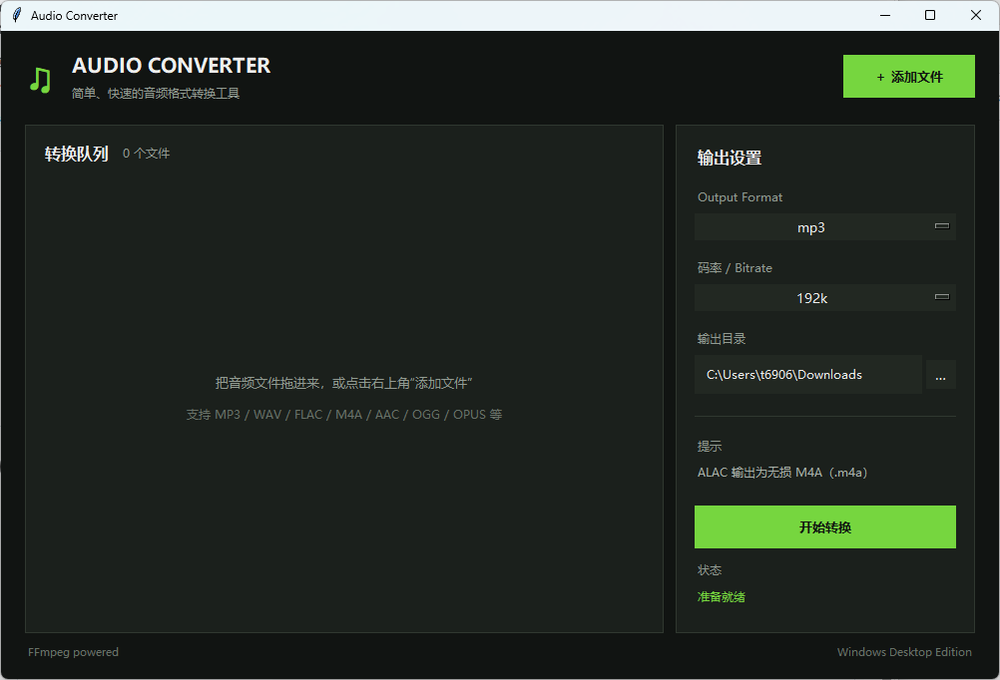

# 🎵 音频转换器 AudioConverter

一个简单易用的 Windows 音频格式转换工具。

## ✨ 主要功能

- 支持多种音频格式转换
- 支持自定义输出格式
- 支持调整音频比特率和采样率
- Windows 便携版，无需安装 Python
- 下载、解压即可运行

## 📥 下载

前往 [Releases（发行版本）](https://github.com/kuomil/AudioConverter-v1.0.0/releases) 下载最新版本。
